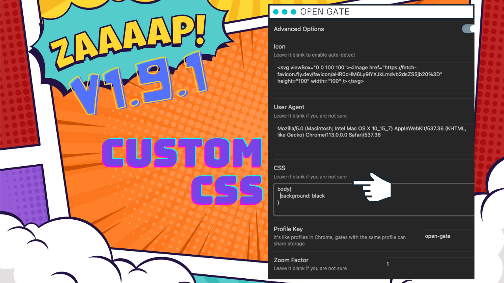

<!-- ALL-CONTRIBUTORS-BADGE:START - Do not remove or modify this section -->
[](#contributors-)
<!-- ALL-CONTRIBUTORS-BADGE:END -->


> Join our discord server: [join now](https://discord.gg/nqqrabWN)

# Obsidian Open Gate

This plugin allows you to embedding any website to Obsidian, you have anything you need in one place. You can browse website and take notes at the same time. e.g. Ask ChatGPT and copy the answer directly to your note.

## Features

-   Embed any website in your Obsidian
-   Auto generate icon
-   Embed any site that can not be embedded by iframe: Google Translate
-   Support for mobile
-   Custom CSS

## Usage

1.  just type `New gate` in command palette
1.  type the url and title of the site you want to embed
1.  click `Create`

Then you will the the icon of then website in the left sidebar.

### Options


Custom CSS



### Add new Gate


Add new gate does not require to restart Obsidian. But editing and deleting gate requires to restart Obsidian.

### Use Code block

You can use a code block with the language set to `gate` to embed any website directly within a note, including custom css.

````markdown
```gate
https://12bit.vn
height: 300
css: |
   html { filter: invert(90%) hue-rotate(180deg)!important; }
```
````

### Quick switcher

You can quickly open gates using a single shortcut. The default is `Ctrl+Shift+G` or `Cmd+Shift+G`. You can change it in the Hotkeys section of Obsidian.


## Deployment

## Contributors ✨

Thanks goes to these wonderful people ([emoji key](https://allcontributors.org/docs/en/emoji-key)):

<!-- ALL-CONTRIBUTORS-LIST:START - Do not remove or modify this section -->
<!-- prettier-ignore-start -->
<!-- markdownlint-disable -->
<table>
  <tbody>
    <tr>
      <td align="center" valign="top" width="14.28%"><a href="https://github.com/andrewmcgivery"><br /><sub><b>andrewmcgivery</b></sub></a><br /><a href="https://github.com/nguyenvanduocit/obsidian-open-gate/commits?author=andrewmcgivery" title="Code">💻</a></td>
      <td align="center" valign="top" width="14.28%"><a href="http://miztizm.com"><br /><sub><b>Digital Alchemist</b></sub></a><br /><a href="https://github.com/nguyenvanduocit/obsidian-open-gate/commits?author=miztizm" title="Code">💻</a></td>
    </tr>
  </tbody>
</table>

<!-- markdownlint-restore -->
<!-- prettier-ignore-end -->

<!-- ALL-CONTRIBUTORS-LIST:END -->

This project follows the [all-contributors](https://github.com/all-contributors/all-contributors) specification. Contributions of any kind welcome!