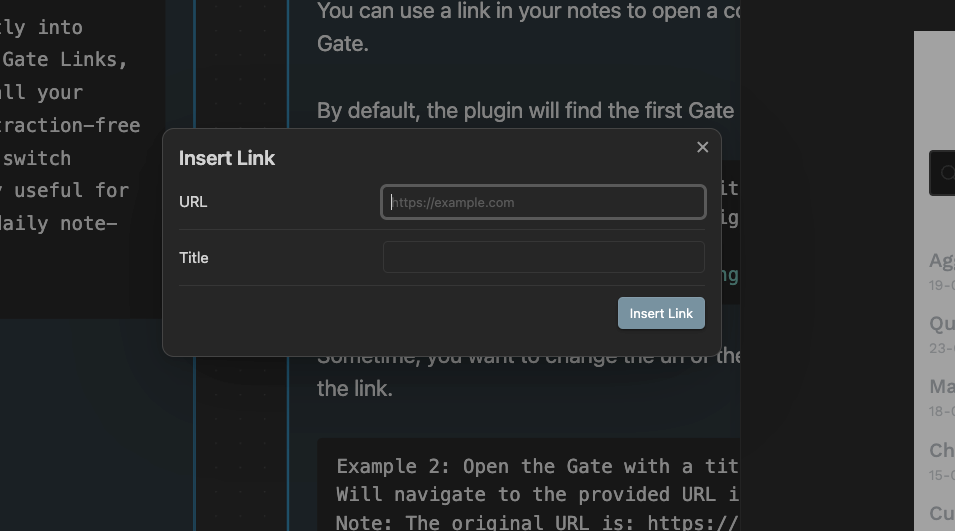

# Gate Link

This feature allows you to create a link that opens a URL within the gate view of Obsidian, rather than navigating away in an external browser

## Usage

```md
[Open Google Gate](obsidian://opengate?title=google&url=https%3A%2F%2Fdocs.google.com%2Fdocument%2Fd%2Fabc123%2Fedit)
```

Please notice that the URL must be encoded. You can use [this tool](https://www.urlencoder.org/) to encode your URL.

You may want to read [Gate Options](gate-options.md) to learn more about the options you can use. Of course, the are no space for custom css or javascript in the gate view.

## Editor context menu

We know that encoding URLs can be a hassle, so we've added a context menu option to make it easier. Just right-click on the link, and select `Insert Gate Link`.

A popup will appear, asking for the title and URL of the gate. The URL will be automatically encoded for you.



## Convert to gate link

If you right-click on a normal link, you will see an option to convert it to a gate link. The URL will be automatically encoded for you.

## Reuse gates

Once again, to simplify the reuse of gates configured in the settings, the plugin automatically matches the title or URL with existing gates. If a match is found, the options from the gate configured in the settings are merged with the options specified in the note.
