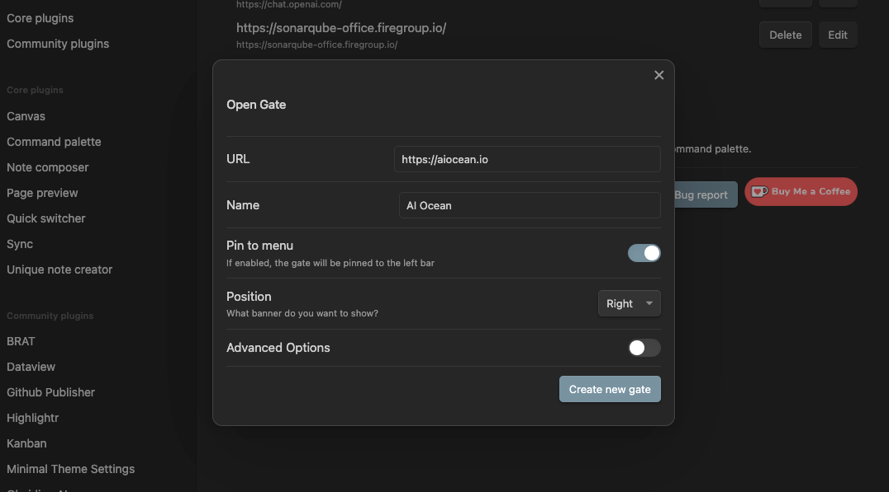

# Getting Started

To begin using the Obsidian Open Gate plugin, follow these simple steps to install it:

1. Direct Install: Navigate to the [Direct Install Link](https://obsidian.md/plugins?id=open-gate). This will take you to the plugin's page in the Obsidian app. Follow the instructions to install.
2. Once installed, access the plugin settings in Obsidian to configure it according to your preferences.
3. To start embedding websites, open the command palette (`Ctrl+P` on Windows/Linux, `Cmd+P` on macOS) and type `Create new gate`. Enter the desired URL and title for the website you wish to embed.
4. Your new gate will now appear in the left sidebar of Obsidian. Click on its icon to view the embedded website within Obsidian.

You may notice that there are several options available for customizing your gates. We will deep dive into these features in the next section. For now, feel free to explore the plugin and experiment with embedding different websites to enhance your note-taking experience.

