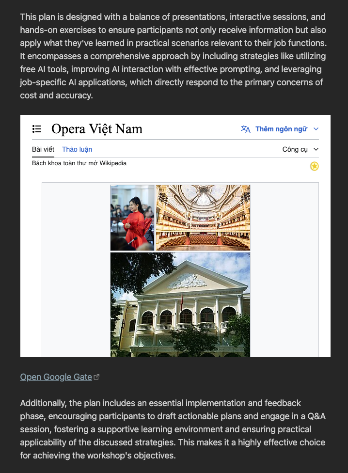

# Inline Embedded

You can embed a view directly in a note:

~~~md
```gate
url: https://12bit.vn
height: 300
zoomFactor: 1
css: |
   html { filter: invert(90%) hue-rotate(180deg)!important; }
```
~~~

Here is the result:



You can use any property from the [Gate Options](gate-options.md) documentation.

## Reuse gates

To simplify the reuse of gates configured in the settings, the plugin automatically matches the title or URL with existing gates. If a match is found, the options from the gate configured in the settings are merged with the options specified in the note.  

For instance, if there is a gate titled `12bit` configured in the settings, you can easily reuse it by only specifying the `title` and any additional option like `height` in your note as shown below:  

~~~md
```gate
title: 12bit
height: 300
```
~~~

This will open the `12bit` gate with a height of `300px`.
